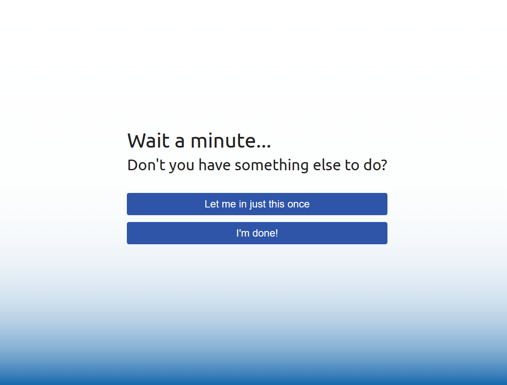
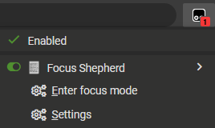
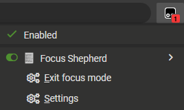
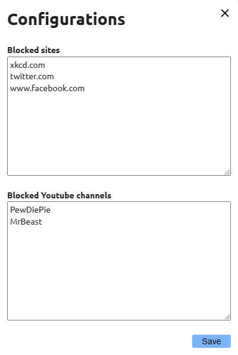

# Focus-Shepherd
*A TamperMonkey script to help you focus when you need it!*

## Why Focus Shepherd?

Most anti-distraction browser plugins have a “hard” limit: you specify a length of time you’d like to focus, and you’re blocked from accessing “distraction” sites until the time is up.

The goal of Focus Shepherd, however, is different. When we get distracted, the following happens:

1. Our brains have an impulsive thought “I’m bored”.
2. Before we’re even aware of it happening, our fingers open a new browser tab and type in our go-to distraction website of choice.
3. We begin surfing to our heart’s content.

The aim of Focus Shepherd is to train you to notice and suppress your impulsive thoughts from step 1. Instead of outright blocking you from accessing these sites, Focus Shepherd will gently remind you that you’re supposed to be focusing. Spend a moment or so to ask yourself “Should I be here?”, and close the tab if you shouldn’t.

However, if you think you need a moment to unwind, then click “Let me in just this once”. If you decided you’ve had enough of work, then click “I’m done” to end the focus session. Either way, this choice is your conscious decision, and not on an unintentional whim.

Sounds interesting? Follow the steps below to install Focus Shepherd.

## Installation

Steps:
1. Install GreaseMonkey/TamperMonkey on your browser of choice.
2. Click [here](https://github.com/Kenneth-LJS/Focus-Shepherd/raw/main/focus-shepherd.user.js) to install the Focus Shepherd script.
3. Confirm the installation.
4. To set up your list of blocked sites, follow the instructions [here](#configurable-block-list).
5. To begin a focus session, click on the GreaseMonkey/TamperMonkey icon on your brower toolbar. Below “Focus Shepherd”, select “Enter focus mode”.

6. To end your focus session, click on the GreaseMonkey/TamperMonkey icon on your brower toolbar again. Below “Focus Shepherd”, select “Exit focus mode”.

## Features

### Non-destructive Reminders

Some anti-distraction browser plugins will redirect you if it detects that you are on a restricted site. They may even redirect tabs that are already open. This has led to a few undesirable consequences:

- Your browser tabs are lost. For some plugins, the “Back” button brings you back to your original site; but for others, the site is gone.
- Half-completed forms, unsent messages, and unsaved posts are lost when the page is forcefully navigated away.
- You lose your position on infinite-scroll pages, 

This has led to me avoiding or even dreading turning on some of these plugins for fear of losing sites that I want to revisit later.

Focus Shepherd shows the focus reminder on top of your browser tabs without modifying any of the content below. This way, when you end your focus session, everything goes back to the way it was.

### Configurable Block List

To access the block list, click on the GreaseMonkey/TamperMonkey icon on your brower toolbar again. Below “Focus Shepherd”, select “Settings”. This will open the settings window.

Enter each site that you would like to block on each line.

### YouTube

Sometimes, you just want a YouTube video to play in the background while you work. Under the [Configurable Block List](#configurable-block-list), you can set up YouTube-specific settings to block particular channels while leaving the rest accessible. No more accidentally locking yourself out of [Lofi Hip-hop Radio - Beats to Relax/Study to](https://www.youtube.com/watch?v=jfKfPfyJRdk).

